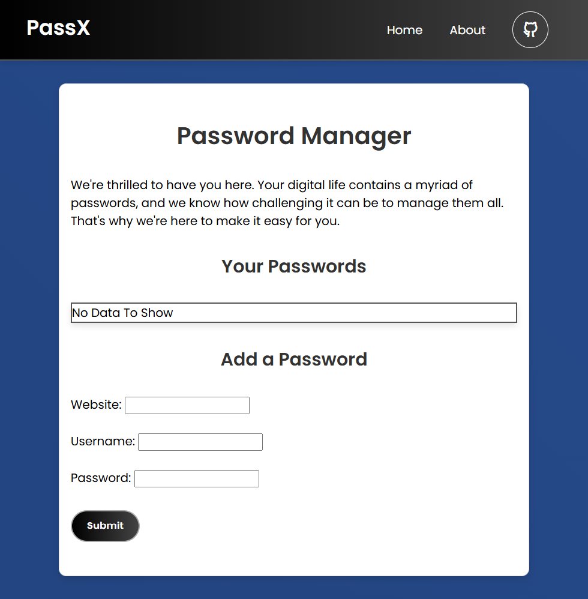

# PassX - Your Personal Password Manager 🔒

Welcome to **PassX**, your ultimate tool for managing passwords with ease and security. In today's digital age, keeping track of all your passwords can be a daunting task. PassX is here to simplify your life by securely storing and organizing your passwords in one convenient place.

## 🌟 Demo | Preview

<div align="center">
  <br />
    <a href="https://pass-x.netlify.app/" target="_blank">
      
    </a>
  <br />
  </div>

## 🌟 Key Features

- 🔐 **Secure Storage**: Safely store and manage your passwords.
- 🖱️ **Easy Copy**: Copy passwords to clipboard with a single click.
- 🗑️ **Delete Function**: Easily delete passwords when they are no longer needed.
- 🌐 **Local Storage**: Keep your data private with local storage.
- 🎨 **User-Friendly Interface**: Enjoy a simple and intuitive design.

## 🚀 Getting Started

To get started with PassX, follow these steps:

1. **Clone the Repository**
   ```bash
   git clone https://github.com/YourUsername/PassX.git
   ```
2. **Navigate to the Project Directory**
   ```bash
   cd PassX
   ```
3. **Open the HTML file**
   Open `index.html` in your preferred web browser.

## 🛠️ How It Works

### 1. Add a Password

Simply fill out the form with the website, username, and password you want to store, and click "Submit". Your password will be saved in local storage.

### 2. View Your Passwords

Your saved passwords will be displayed in a table, where you can copy them to the clipboard or delete them.

### 3. Copy to Clipboard

Click the copy icon next to any password to quickly copy it to your clipboard.

### 4. Delete a Password

Click the "Delete" button to remove any password from the list.

## 👨‍💻 About the Developer

PassX was developed by **MDSaifProgDev**. With a passion for creating efficient and secure tools, MDSaifProgDev has put their expertise to work in building PassX to address the challenges of managing multiple passwords.

- **Github Profile**: [MDSaifPro](https://github.com/MDSaifPro)
- **Personal Portfolio**: [🔗 Link to Portfolio ](https://mdsaifprog2.netlify.app)

## 📄 License

This project is licensed under the MIT License. See the [LICENSE](LICENSE) file for details.

## 📧 Contact

If you have any questions, suggestions, or feedback, feel free to reach out:

- Email: [MD Saif Prog Dev.](mailto:mdsaifullahprogrammer@gmail.com.com)

Thank you for using PassX! We hope it makes managing your passwords a breeze. 🚀🔒
